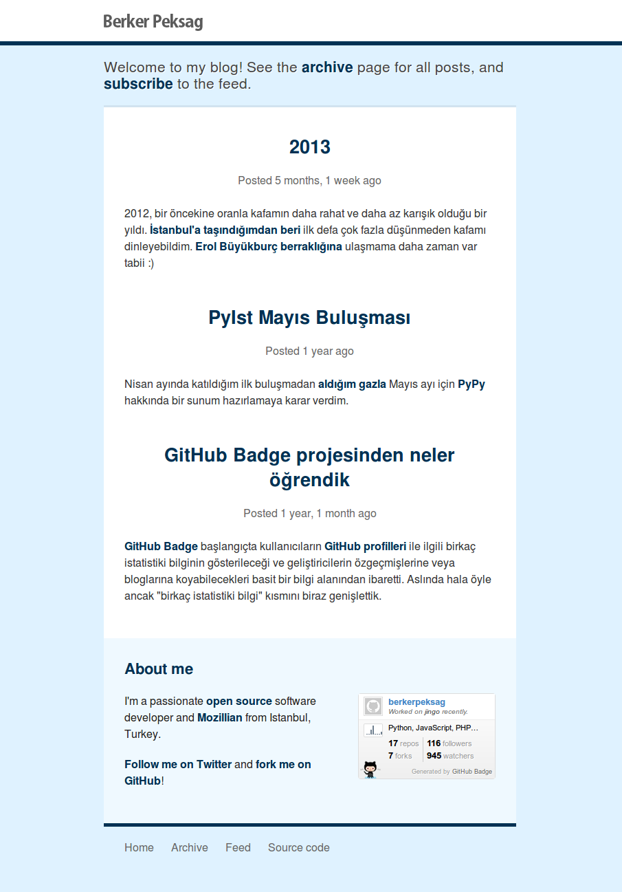

## Installation

**Note:** You need to install [Fabric][fabric] and [Virtualenv][venv] system
wide via *pip* or *easy_install*.

```sh
$ git clone git://github.com/berkerpeksag/berkerpeksag.git
$ cd berkerpeksag/
$ fab dev
```

## Running the development server

**Note:** If you don't use [autoenv][autoenv], you need to activate
Virtualenv manually.

```sh
$ fab server
# or
$ python manage.py runserver
```

## Theme



## License

All files that are part of this project are covered by the following license,
except where explicitly noted.

> This Source Code Form is subject to the terms of the Mozilla Public
> License, v. 2.0. If a copy of the MPL was not distributed with this
> file, You can obtain one at http://mozilla.org/MPL/2.0/.

[fabric]: http://fabfile.org
[venv]: http://virtualenv.org
[autoenv]: https://github.com/kennethreitz/autoenv
